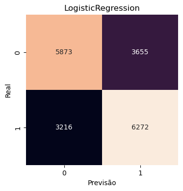
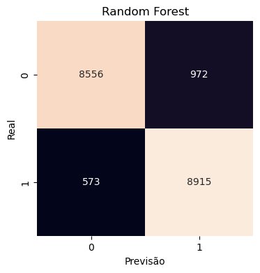
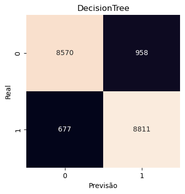
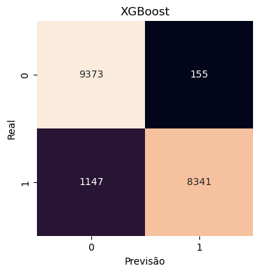
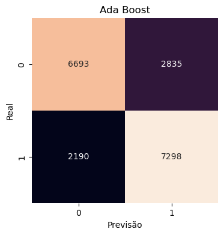
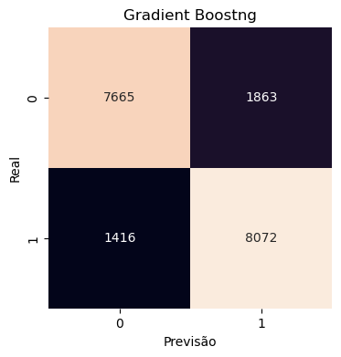

# Detecção de Fraude com Machine Learning

Este projeto aplica algoritmos de aprendizado de máquina para detectar transações financeiras fraudulentas em um 
conjunto de dados sintético. O objetivo é explorar e comparar modelos de classificação com foco em precisão, recall 
e capacidade de identificar fraudes de forma eficiente.

## 📁 Estrutura do Projeto

* data/: Conjuntos de dados utilizados no projeto.
* notebooks/: Notebooks Jupyter com todas as etapas do projeto — desde análise exploratória até avaliação dos modelos.
* README.md: Documentação do projeto.

## 📊 Conjunto de Dados

O dataset simula transações financeiras com atributos como:
* Valor da transação
* Informações do cliente (ex: idade, localização)
* Indicador binário de fraude

Esse tipo de base é tipicamente desbalanceado — ou seja, há muito mais transações legítimas do que fraudulentas.

## 🧠 Modelos Utilizados
Foram implementados e avaliados os seguintes modelos de classificação:

* Random Forest 
* Gradient Boosting
* AdaBoost
* Regressão Logística
* Árvore de Decisão
* XGBoost

## 📈 Resultados

### 🎯 Matrizes de Confusão

<table>
  <tr>
    <td><strong>Logistic Regression</strong></td>
    <td><strong>Random Forest</strong></td>
    <td><strong>Decision Tree</strong></td>
  </tr>
  <tr>
    <td></td>
    <td></td>
    <td></td>
  </tr>
  <tr>
    <td><strong>XGBoost</strong></td>
    <td><strong>Ada Boost</strong></td>
    <td><strong>Gradient Boosting</strong></td>
  </tr>
  <tr>
    <td></td>
    <td></td>
    <td></td>
  </tr>
</table>
